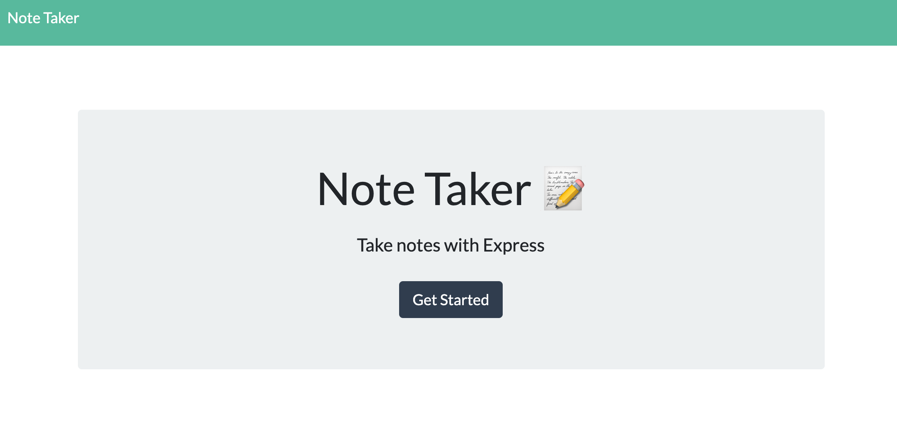
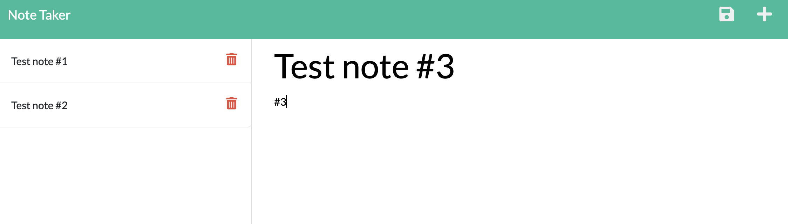

# Note Taker

## Description
This application allows the user to create, save, and delete notes.

## Table of Contents
* [Installation](#Installation)
* [Usage](#Usage)
* [License](#License)
* [Questions](#Questions)
* [Acknowledgements](#Acknowledgements)

## Installation
To install this project, open [https://valerie-note-taker.herokuapp.com/](https://valerie-note-taker.herokuapp.com/) in your browser.

## Usage
Select 'get started' and add a new note with a title and text. Press the save button to saveyour note. Press the trashcan button to delete your note.

## License
MIT

## Questions
For additional information please contact me via GitHub at [https://github.com/vmichalecki](https://github.com/vmichalecki) or via email at [valerie227@gmail.com](mailto:valerie227@gmail.com?subject=[GitHub]%Note%Taker).

## Acknowledgements
Miguel Alicea [https://github.com/malicea0783](https://github.com/malicea0783)

